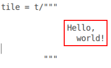

# Tiles

> **Tiles** is a simple Python module meant to help with **code generation**.
It provides a way to work with **rectangular areas of text** as atomic units.
This is particularly important if proper **indentation** of the generated code
is desired.

### Import the module

```python
from tiles import t
```

### Tile literals

Tile is a rectangular block of text.

Tile literal is `t/` followed by a string. For example:

```python
tile1 = t/"hello"

tile2 = t/'world'

tile3 = t/"""
          Hello,
            world!
          """
```

However, keep in mind that it's just the rectangular area of text that counts.
All the surrounding whitespace is of no significance.



This makes it easy to align tile literls with the rest of the program. Given
that the whitespace doesn't count, the literal can be shifted as much to the
left or right as needed:

```python
if x:
    for item in lst:
        tile = t/"""
                 Hello,
                   world!
                 """
```

### Tile interpolation

Very much like string interpolation (F-strings), tiles allow to insert pieces
of text into the template. To do so, use `@{}` syntax:

```python
h = "Hello"
w = "world"
tile = t/"""
          @{h},
            @{w}!
          """
print(tile)
```

The output:

```
Hello,
  world!
```

However, unlike with F-strings, the interpolated pieces of text are treated
as tiles (rectangular areas of text) rather than as simple strings:

```python
h = "Hello"
w = t/"""
      cruel
      world
      """
tile = t/"""
          @{h}
            @{w}
          """
print(tile)
```

The output:

```
Hello
  cruel
  world
```

See "worked example 1" to get better undestanding of the tiling alorithm.

### Combining tiles

While tile interpolation provides the most generic mechanism for combining
tiles into larger tiles, sometimes you want just to put one tile besides
another as quickly and simply as possible.

To achieve that, tiles support two convenience operators.

Operator + puts two tiles beside each other:

```python
tile1 = t/"""
          Magenta
          Green
          """

tile2 = t/"""
          Red
          Blue
          White
          """

print(tile1 + tile2)
```

Results in:

```
MagentaRed
Green  Blue
       White
```

Operator | (pipe) puts two tiles one on top of the other:

```python
tile1 = t/"""
          Magenta
          Green
          """

tile2 = t/"""
          Red
          Blue
          White
          """

print(tile1 | tile2)
```

Results in:

```
Magenta
Green
Red
Blue
White
```

Of course, operators += and |= work as expected:

```python
tile = t/"""
         Magenta
         Green
         """

tile += t/"""
          Red
          Blue
          White
          """

print(tile)
```

Results in:

```
MagentaRed
Green  Blue
       White
```

# Joining many tiles

Joining works similarly to joining strings:

```python
tile = (t/",").join([t/"square", t/"circle", t/"triangle"])
print(tile)
```

Results in:

```
square,circle,triangle
```

There is also a special function for joining tiles in vertical manner:

```python
tile = (t/",").vjoin([t/"square", t/"circle", t/"triangle"])
print(tile)
```

Results in:

```
square,
circle,
triangle
```

Function `vjoin` has an optional parameter `inline` (true by default) which
puts the separator at the same line with the list item. If switched off,
the separator will appear on its own line:

```python
tile = (t/"---").vjoin([t/"square", t/"circle", t/"triangle"], inline=False)
print(tile)
```

Results in:

```
square
---
circle
---
triangle
```

Finally, both `join` and `vjoin` have `last` argument which acts as a kind
of a final separator:

```python
tile = (t/",").vjoin([t/"square", t/"circle", t/"triangle"], last=t/";")
print(tile)
```

Results in:

```
square,
circle,
triangle;
```

### Working with whitespace

Given that standard tile literals cut off the surrounding whitespace from the
tile we need to use a different construct when we actually want the surrounding
whitespace to appear in the tile. `t%` can be used to achive that.

`t/"   foo   "` produces `foo` tile.

`t%"   foo   "` produces `   foo   ` tile.

```python
tile = (t%", ").join([t/"square", t/"circle", t/"triangle"])
print(tile)
```

Results in:

```
square, circle, triangle
```

Note that `t%""` produces a tile with **one** empty line and `t%"\n"` produces
a tile containing **two** empty lines.

To get a completely empty tile with **zero** lines use `t/""`.

```python
tile = t/"""
         Magenta
         Green
         """

tile += t%"" | t/"""
                 Red
                 Blue
                 White
                 """
```

Results in:

```
Magenta
Green

Red
Blue
White
```

### Worked example 1

```python
from tiles import tile

colors = t/"""
           White
           Black
           Ultramarine
           Red
           Green
           Blue
           """

shapes = t/"""
           Triangle
           Circle
           """

tile = t/"""
         Colors: @{colors}     Shapes: @{shapes}

         That's all, folks!
         """)

print(tile)
```

On the picture below you can see how are individual tiles combined to produce
the final output. Tiles are shown in red frames. Literal text is in blue frames.
Black lines mark boundaries between individual lines.


### Worked example 2

Imagine that we want to generate code that prints out some greetings.

```python
def greet(name):
    return "print('Hello, " + name + "!')\nprint('Welcome!')" 
```

Although there is no particular need for manipulating rectangular areas of text
in this case tiling can be employed to make the code more readable.

```python
def greet(name):
    return t/"""
             print('Hello, @{name}!')
             print('Welcome!')
             """
```

Given that whitespace surrounding the tile is ignored anyway we can neatly
align the generated code with the generator code instead of writing an
abomination like this one:

```python
def greet(name):
    return tile("""print('Hello, @{name}!')
print('Welcome!')""")
```

Another consequence of using tiles is that the greeting function can be used
in different contexts and the indentation will allways fit:

```python
code = t/"""
         import sys

         @{greet('Alice')}
         if 'also-greet-bob' in sys.argv:
             @{greet('Bob')} 
         """

print(code)
```

Here's the output. Note how the greeting code is properly aligned in both
cases, forming a valid Python program:

```python
import sys

print('Hello, Alice!')
print('Welcome!')
if 'also-greet-bob' in sys.argv:
    print('Hello, Bob!')
    print('Welcome!')
```

### Worked example 3

Tiling can be used to generate code with clean vertical alignment.
Consider the case where we have a lists or argument names and types and we
want to generate a nicely formatted C function declaration.

```python
arglist = [t/"foo", t/"bar", t/"baz"]
typelist = [t/"int", t/"char*", t/"struct quux"]

argtile = (t/"").vjoin(arglist)
typetile = (t/",").vjoin(typelist, last=t/");")

signature = t/"void frobnicate(@{argtile} @{typetile}"
            
print(signature)
```

The tile with argument names is put next to the tile with argument types.
This is done on tile, not line, level which means that all the argument
names stay aligned with each other.

```
void frobnicate(int         foo, 
                char*       bar,
                struct quux baz);
```

### Notes

Note 1: If you need sequence `@{` to appear in the output (and not be treated
like an embedded expression) it can be done like this: `@{'@'}{`

Note 2: The trailing whitespace that is required to keep the rectangular shape
of a tile doesn't get into the output. This makes the algorithm friendy to
different tools that complain about whitespace at the end of a line.

