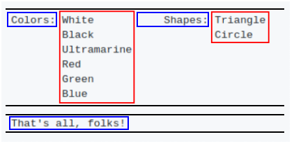

# Tiles

> **Tiles** is a simple Python module meant to help with **code generation**.
It provides a way to work with **rectangular areas of text** as atomic units.
This is particularly important if proper **indentation** of generated code is
desired.

Tile is a standard Python string. However, one should keep in mind that
it's just the ractangular area of text that counts. All the surrounding
whitespace has no significance.


The module provides a single function that can be used to combine smaller
tiles to create larger tiles:

```python
from tiles import tile

colors = """
         White
         Black
         Ultramarine
         Red
         Green
         Blue
         """

shapes = """
         Triangle
         Circle
         """

output = tile("""
              Colors: @{colors}     Shapes: @{shapes}

              That's all, folks!
              """)

print output
```

The output looks like this (expanded tiles marked in red):


### Worked example

Imagine that we want to generate code that prints out some greetings.

```python
def greet(name):
    return "print 'Hello, " + name + "!'\nprint 'Welcome!'" 
```

Although there is no particular need for manipulating rectangular areas of text
in this case tiling can be employed to make the code more readable.

```python
def greet(name):
    return tile("""
                print 'Hello, @{name}!'
                print 'Welcome!'
                """)
```

Given that whitespace surrounding the tile is ignored anyway we can neatly
align the generated code with the generator code instead of writing an
abomination like this:

```python
def greet(name):
    return tile("""print 'Hello, @{name}!'
print 'Welcome!'""")
```

Another consequence of using tiles is that the greeting function can be used
in different contexts and the indentation will allways fit.

```python
code = tile("""
            import sys

            @{greet('Alice')}
            if 'also-greet-bob' in sys.argv:
                @{greet('Bob')} 
            """)

print code
```

Here's the output. Note how the greeting code is properly aligned in both
cases, thus forming a valid Python program.

```python
import sys

print 'Hello, Alice!'
print 'Welcome!'
if 'also-greet-bob' in sys.argv:
    print 'Hello, Bob!'
    print 'Welcome!
```

### Another worked example

Tiling can be also used to generate code with clean vertical alignment.
Consider the case where we have a lists or argument names and types and we
want to generate a nicely formatted C function declaration.

```python
args = ["foo", "bar", "baz"]
types = ["int", "char*", "struct quux"]

print tile(r'void frobnicate('
           r'@{"\n".join(types)} '
           r'@{"\n".join(args)}'
           r'@{",\n" * (len(args) - 1) + ");"}'
          )
```

The tile with argument names is put next to the tile with argument types.
This is done on tile, not line, level which means that all the argument
names stay aligned with each other.

```c
void frobnicate(int         foo, 
                char*       bar,
                struct quux baz);
```

### Tiling algorithm

For reference, this is how the tiling algorithm works.

It parses the supplied string line by line. Each line consists of literal
text mixed with @{} expressions. Each piece of literal text is kept as is.
Each @{} expression is evaluated and replaced by the resulting tile. Both
the literal text and the tiles are aligned to the top of the line.

Thus, a line like this:

```
Colors: @{colors}     Shapes: @{shapes}

That's all, folks!
```

Is rendered like this. Tiles are shown in red frames. Literal text is in blue
frames. Black lines mark boundaries between individual lines.



Note 1: Output of tile() function itself is not stripped off
the surrounding whitespace. This allows for generating programs that start
or end with empty lines. If you want to remove the whitespace you can do
so like this: `tile("@{code}")`

Note 2: If you need sequence `@{` to appear in the output (and not be treated
like an embedded expression) it can be done like this: `@{'@'}{`

Note 3: The trailing whitespace that is required to keep the rectangular shape
of a tile doesn't get into the output. This makes the algorithm friendy to
different tools that complain about whitespace at the end of a line.

