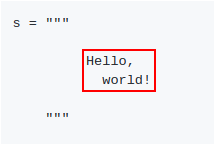

# Tiles

*Tiles* is a simple Python module meant to help with **code generation**.
It provides a way to deal with **rectangular areas of text** as atomic units.
This is particularly important if proper **indentation** of generated code is
desired.

Tile is a standard Python string. However, one should keep in mind that
conceptually it's just the ractangular area of text that counts. All the
surrounding whitespace has no significance.



The module provides a single function that can be used to combine smaller
tiles to create larger tiles:

```python
from tiles import tile

colors = """
         White
         Black
         Ultramarine
         Red
         Green
         Blue
         """

shapes = """
         Triangle
         Circle
         """

output = tile("""
              Colors: @{colors}     Shapes: @{shapes}

              That's all, folks!
              """)

print output
```

The output looks like this:

```
Colors: White           Shapes: Triangle
        Black                   Circle
        Ultramarine
        Red
        Green
        Blue

That's all, folks!
```
